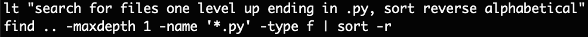
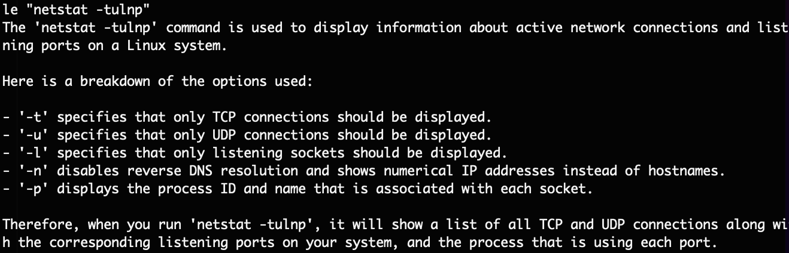

# LLM shell translator

This is a simple script to enhance your productivity in the linux terminal, 
by enabling you to read and write bash commands in plain English.  In essence,
this gives you a universal translator to the linux terminal. This is
powered by the OpenAI API.

Caution: This is meant as a fun scripting exercise ONLY. This is  not a production-ready tool. 
It is similar to, but less polished than the GitHub Copilot in CLI. It's also not free, as each invocation 
requires API calls that you pay for. 

WARNING: This script has no safety guarantees. It's possible the script could 
output harmful or incorrect linux commands.  Hence, use it with caution! 

For real world uses (beyond experimentation), use professional tools.

For a more powerful command line llm tool, see (e.g.): [llm](https://github.com/simonw/llm)

## Use case
Example: suppose you don't remember the shell command to search files and sort 
them in reverse order.  Just use the new terminal command **lt** (short for 
"llm translate") followed by your question in quotes. lt will 
translate your question (top line) to a working linux command (bottom line):
  
If you're satisfied with the command, just copy and run it.

On the other hand, if you see a linux command you don't understand, just use
the command **le** (for "llm explain") followed by the command in quotes. 
(First line in image below.) The script will explain the command
in the lines below (2nd and later lines in image.)


## Installation

### Python script setup
Instructions for unix/mac:
1. Clone this repo 
1. Make sure you have the openai python library installed
    ```shell
    pip install openai
    ```
1. Make the python script executable:
    ```shell
    chmod +x llm-assistant.py
    ```

## Bash setup
Open your ~/.bash_profile (or .zshrc) file and add the following:

```shell
export OPENAI_API_KEY=XXXX

function lt() {
  python ~/PATH-TO-REPO/llm-assistant.py -t -p "$1" 
}
function le(){
  python ~/PATH-TO-REPO/llm-assistant.py -e -p "$1"
}
```
Fill in your OpenAI api key. Also update the paths to where you cloned this repo.

Then save and open a new bash shell, or update your existing shell:
```shell
source ~/.bash_profile
```

Note: if you've installed openai in a specific conda environment, you can run the script with that environment by activating and deactivating the environment in the bash functions, like this:
```shell
function lt() {
  conda activate openaienv
  python ~/PATH-TO-REPO/llm-assistant.py -t -p "$1"
  conda deactivate
}
```

